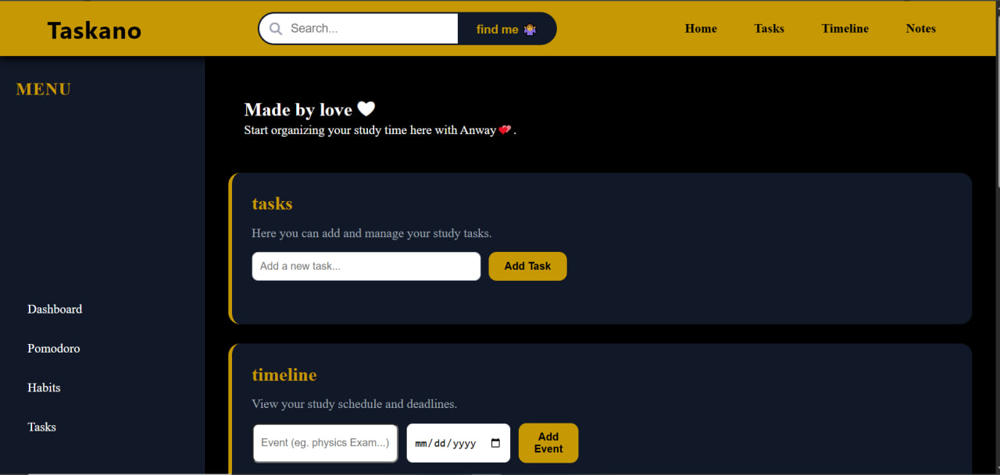
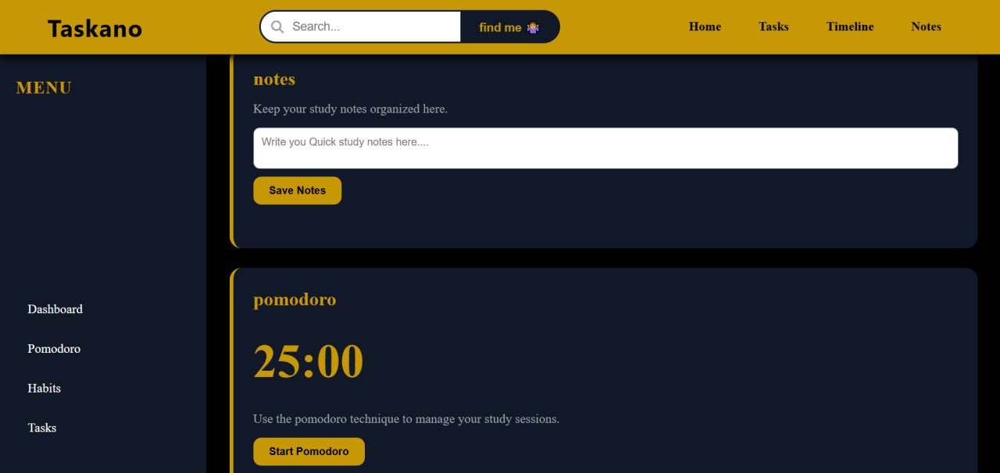

# Taskano

Taskano is a dark-themed Study Dashboard designed to help students manage tasks, track habits, and maintain focus using an integrated Pomodoro timer.

## Screenshots

## Features
* **Task Management:** A simple interface to create, organize, and monitor daily study tasks.
* **Habit Tracking:** A system to build and maintain consistency with daily routines.
* **Pomodoro Timer:** A built-in countdown timer based on the Pomodoro technique to manage study sessions and breaks.
* **Dark Theme:** A clean, minimal dark user interface optimized for long study hours and reduced eye strain.

## Tech Stack
* HTML5
* CSS3
* Vanilla JavaScript

## How to Run
1. Download or clone the project repository to your local machine.
2. Locate the main directory and open the `index.html` file in any modern web browser.
3. No additional installation or dependencies are required.

## Contributing
Contributions are welcome to help improve this project. To contribute, please follow these steps:
1. Fork the repository to your own GitHub account.
2. Create a new branch for your feature or bug fix (`git checkout -b feature-name`).
3. Commit your changes with clear and descriptive messages (`git commit -m 'Description of changes'`).
4. Push the changes to your branch (`git push origin feature-name`).
5. Open a Pull Request against the main branch of this repository for review.
